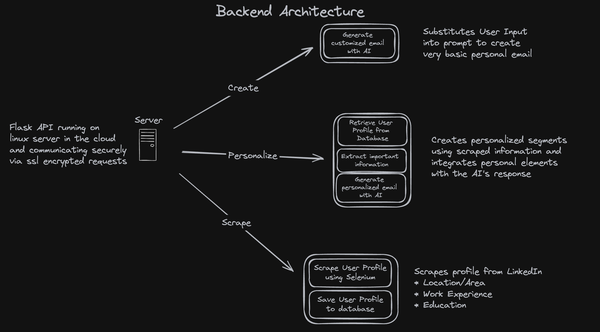

# Email Surge - Backend
Overview of Project

## Technologies Used

This is a list of all the technologies that can be found in the backend application for Email Surge.

* [Python](https://python.org/)
* [Flask](https://flask.palletsprojects.com/en/3.0.x/)
* [Selenium](https://selenium.dev/)
* [OpenAI](https://openai.com/)
* [PostgreSQL](https://www.postgresql.org/)
  

## Special Concepts
Functional
* Web Scraping & Automation
* REST APIs
* Programmatic AI Generation
* Caching

Backend Server
* Linux
* SSH
* Use of the Linux CLI

Networking (Domain & Server)
* Firewalls
* Port Forwarding
* DNS
* SSL/TLS
* SSL Certificates

## Deployment

The backend API code for this project was deployed to a Linux VPS running in the cloud.
